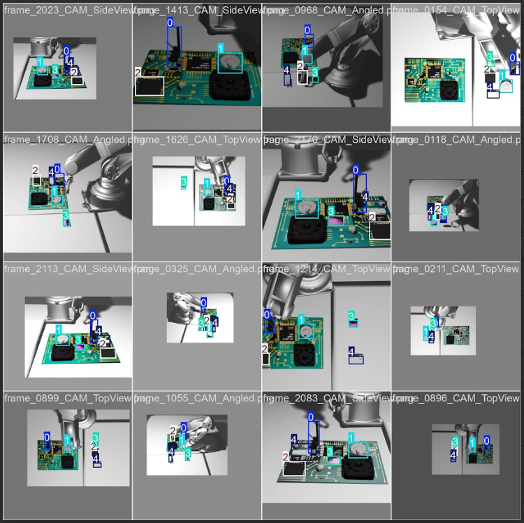
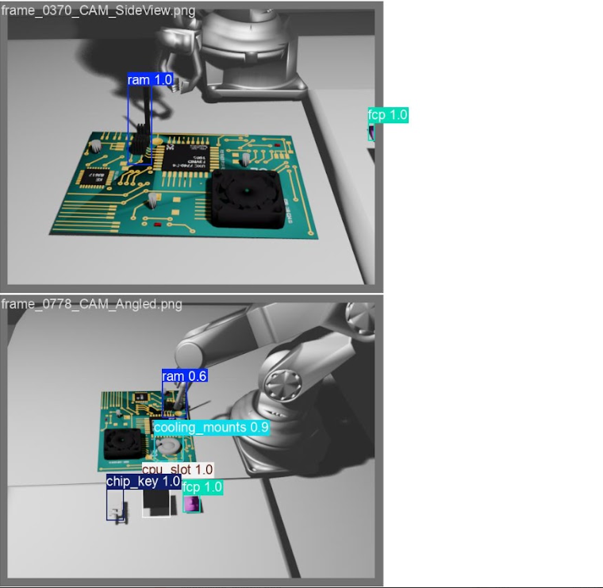

  

🔧 LFX Mentorship @ CNCF KubeEdge-Ianvs

Working on Ianvs, the distributed collaborative AI benchmarking platform under KubeEdge. Contributed a deformable component assembly benchmark using YOLOv8 for object detection combined with force/torque sensor data, simulating real edge-robotics evaluation pipelines.

Built the benchmark dataset + evaluation harness for edge-AI object assembly tasks
Designed Ianvs visualizations: architecture flowcharts, roadmap diagrams, contribution stats
Delivered a 30-min technical talk, "KubeEdge Deep Dive — Extending Kubernetes to the Edge," at KubeCon India

</td>
<td width="45%" valign="top">
